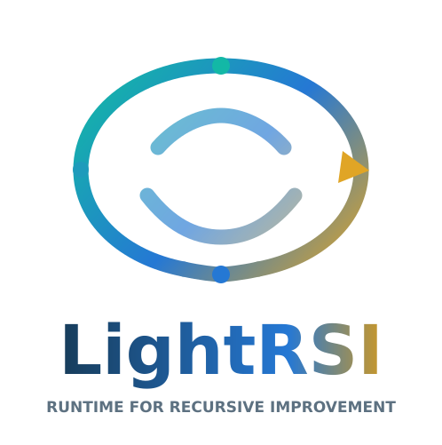

<p align="center">
  
</p>

<p align="center">
  <strong>Compact, recoverable context management for long-running AI coding agents.</strong>
</p>

<p align="center">
  
  
  
  
  
</p>

<span id='fork'/>

## 🌿 About This Fork

AI coding agents repeatedly process large test logs, file contents, and other
tool outputs during long sessions. That increases token usage and provider cost
even when much of the information is no longer needed.

This independently maintained fork builds on [LightRSI](https://github.com/zjunlp/LightRSI) and its TokenPilot foundation. It focuses on reducing that overhead while preserving important evidence.

In a paired live evaluation of 120 requests, Compact processing reduced input
tokens by **60.91%** and estimated provider cost by **35.11%** versus processing
the same sessions with full, uncompressed tool outputs.

This is **not** a drop-in superset. It carries intentional product and architecture differences from upstream.

> **In short:** Compact admission reduces oversized observations before they enter
> active context. Context Cleaner lets the agent release specific old messages and
> tool outputs when they are no longer useful.

| Area | Original LightRSI | This fork | Why it matters |
| :-- | :-- | :-- | :-- |
| Context admission | Existing TokenPilot reduction and context stabilization | Stable, recoverable admission for eligible oversized observations | Lower input usage while preserving exact recovery |
| Context Cleaner | Groups context by task and asks for approval | Lets the agent release specific messages or tool outputs, then checks them before removal | Less obsolete context without hidden deletion decisions |
| Context lifecycle | Estimator and task-state management | Session-scoped releases with clear ownership and safety checks | Easier to understand and recover |
| Codex transport | Local Responses proxy | Preserves provider requests, handles older payloads, retries cache compatibility issues, and records cache usage | Fewer provider-specific failures |
| Long sessions | Shared runtime lifecycle behavior | Journals requests and responses, replays history, and recovers the daemon after restart | Better continuity and diagnosis |
| Claude Code | Host-facing Cleaner surface | Gateway routing, shared status/report/doctor commands, MCP recovery, and session-start recovery | Clearer local integration boundaries |
| Validation | Upstream test suite | Targeted tests for forwarding, replay, cache usage, watchdogs, Cleaner execution, and recovery | Changes stay measurable and reviewable |

Upstream attribution remains with [zjunlp/LightRSI](https://github.com/zjunlp/LightRSI); this fork is independently maintained and does not imply upstream endorsement.

### Why use this fork?

- **Reliable long sessions:** keep forwarding, history, and restart recovery predictable.
- **Easy to inspect:** use `status`, `doctor`, `report`, cache audits, and browser visuals to see what the runtime is doing.
- **Provider-friendly:** preserve each provider's request format and configured identity while adding local optimization.

<span id='fork-workflow'/>

### 🧭 Forked LightRSI Workflow

The interactive workflow covers request intake, context admission, provider
forwarding, session history, restart recovery, and health inspection. Agent-directed
historical release remains a separate Cleaner path.

<p align="center">
  
</p>

[Open the interactive workflow](./docs/diagrams/forked-lightrsi.workflow.html) · [View the Archify source](./docs/diagrams/forked-lightrsi.workflow.json)

<span id='compact-context'/>

## 📦 Compact, Recoverable Context

Coding agents regularly produce large tool outputs: compiler errors, test logs,
file contents, search results, and command output. Repeating those full
observations on later requests increases context size and provider cost.

Compact admission reduces eligible observations before they enter active
context, while retaining the original content for exact recovery.

1. A tool produces an observation.
2. For eligible large outputs, LightRSI prepares a shorter representation and
   preserves the original before omitting information.
3. The AI receives the compact representation and a recovery reference.
4. Stable admitted history survives supported continuation and restart paths.
5. The agent retrieves the original when omitted evidence is needed.

Compact admission handles new observations. Context Cleaner handles historical
information that has become obsolete and releases only occurrences selected by
the active agent after safety validation.

<span id='context-cleaner'/>

## 🧹 Agent-Directed Context Cleaner

Long-running coding agents accumulate completed investigations, obsolete tool output, and intermediate context that no longer contributes to the current task.

This fork replaces Codex's live task-first Cleaner workflow with agent-directed, session-scoped occurrence pruning.

Here, an **occurrence** means one specific message, tool result, or related context item.

- **One decision owner:** the active agent selects what is no longer useful; Cleaner does not independently estimate task completion or select context for removal.
- **Exact release:** each operation targets explicitly identified occurrences rather than broad task-level deletion.
- **Deterministic safety:** fingerprints, protected items, retained findings, affected tool relationships, and execution evidence constrain removal.
- **Durable continuation:** lifecycle and dispatch state, journals, claims, epochs, and receipts support consistent application and recovery.

TokenPilot optimizes how context is carried. Context Cleaner executes an agent's explicit decision to release context.

<span id='engineering-contributions'/>

## 🛠️ What Changed in This Fork

| What changed | Problem solved | Practical impact |
| :-- | :-- | :-- |
| Added stable, recoverable Compact admission | Large tool outputs repeatedly consume active context | Lower input usage and estimated provider cost on the evaluated workload |
| Redesigned Codex Context Cleaner around agent-authorized occurrence release | Competing task-estimation and selection owners | Exact context release with deterministic safety checks |
| Hardened provider forwarding and Responses compatibility | Provider routes and payload variations | More reliable interoperability |
| Implemented durable session history and recovery | Runtime interruptions and continuation | Committed context decisions survive restart |
| Strengthened Windows daemon and runtime lifecycle | Manual recovery after install or restart | Safer, lower-touch daily operation |
| Built cache telemetry and reproducible A/B benchmarks | Unknown token, latency, and cache behavior | Evidence-based optimization |

Evidence: [`components/packages/features/cleaner`](./components/packages/features/cleaner), [`components/adapters/codex`](./components/adapters/codex), [`components/adapters/codex/tests`](./components/adapters/codex/tests), [`components/adapters/codex/scripts/benchmark-context-cleaner.ts`](./components/adapters/codex/scripts/benchmark-context-cleaner.ts), and [`docs/superpowers/plans/2026-09-22-context-cleaner-benchmark-plan.md`](./docs/superpowers/plans/2026-09-22-context-cleaner-benchmark-plan.md).

<span id='fork-validation'/>

## 🧪 How We Validate It

This fork includes targeted regression tests and benchmarks for Compact
admission, Codex forwarding, occurrence release, session continuation, recovery,
and cache behavior.

Cleaner validation covers cumulative continuation, repeated releases, retained
context, and proxy restart. Performance measurements capture forwarded payload
size, provider-reported usage when available, and request timing.

### Compact Admission — Live Full-Output Comparison

The same three sessions were evaluated with full tool outputs and with Compact
admission enabled. The evaluation used three seeds, 20 continuation turns per
seed and configuration, and 120 provider requests total through `9Router` using
the `combo-normal` model.

| Metric | Full tool output | Compact | Result |
| :-- | --: | --: | :-- |
| Provider requests | 60 | 60 | Same workload |
| Input tokens | 8,255,954 | 3,227,188 | **60.91% lower** |
| Estimated provider cost | $1.545276 | $1.002771 | **35.11% lower** |
| Quality-gate runs | 3/3 | 3/3 | Passed |
| Tool-call closure | 60/60 | 60/60 | Passed |

Per-seed estimated cost savings were **76.99%**, **27.75%**, and **20.44%**.
The variation indicates that benefit depends on session content and context
characteristics.

Both configurations passed all three seeded quality evaluations, including all
six critical-fact checks and 120 tool-call closure checks. Proxy restart was
exercised after turn 10 in every run, but this benchmark does not independently
assert restart correctness. Passing these gates does not establish universal
answer-quality equivalence.

These results apply only to this workload, model, provider, and pinned pricing
assumptions. They do not establish universal savings across models, providers,
coding tasks, or session lengths. See the [sanitized benchmark record](./docs/benchmarks/full-compact-live-evaluation.md)
for pricing assumptions, provenance, and limitations.

### Historical Context Release — Separate Experiment

Historical occurrence release was evaluated independently from Compact
admission. In an earlier 20-pair live Keep/Release comparison, release reduced
input tokens by 0.25% but increased estimated marginal provider cost by 11.07%.
The tested releases disrupted prompt-cache reuse enough to offset their token
savings. This result does not contradict Compact admission: the two experiments
change context at different stages.

LightRSI therefore treats historical release as an agent-authorized operation,
not as an assumed cost optimization.

See [`docs/benchmarks/impact-report.md`](./docs/benchmarks/impact-report.md) for
the historical measurement scope and limitations.

### Upstream TokenPilot reference results

Inherited TokenPilot research results remain documented in
[Experimental Results](#experimental-results). They are not measurements of
this fork.

Existing fork-specific benchmark scripts live under [`components/adapters/codex/scripts`](./components/adapters/codex/scripts) and [`components/packages/features/stabilizer/scripts`](./components/packages/features/stabilizer/scripts). The Compact live result is summarized in the [sanitized benchmark record](./docs/benchmarks/full-compact-live-evaluation.md).

See the benchmark scripts under [`components/adapters/codex/scripts`](./components/adapters/codex/scripts)
and the recorded results under [`docs/superpowers/plans`](./docs/superpowers/plans).

---

<span id='components'/>

## 🧩 Components

LightRSI separates reusable improvement capabilities from shared runtime infrastructure and host-specific integration. TokenPilot is the first production preset; memory writeback, model adaptation, and agent-architecture evolution can build on the same runtime boundaries over time.

| Component | What It Does | How It Works | Effect |
| :-- | :-- | :-- | :-- |
| `TokenPilot` | Keeps long-running agent sessions smaller, cheaper, and easier to sustain | Stabilizes the reusable prompt prefix, trims oversized tool output before it poisons later turns, and limits how much old context is carried forward as sessions grow | Better cache reuse, lower token usage, lower cost, and less context bloat in shared sessions |
| `Context Cleaner` | Releases explicitly selected obsolete context from long-running sessions | Inspects exact occurrences, validates relationships and safety evidence, then commits durable releases | Agent-controlled context reduction without hidden task-level deletion decisions |

<span id='contents'/>

## 📑 Table of Contents

* <a href='#fork'>🌿 About This Fork</a>
* <a href='#fork-workflow'>🧭 Forked LightRSI Workflow</a>
* <a href='#compact-context'>📦 Compact, Recoverable Context</a>
* <a href='#context-cleaner'>🧹 Agent-Directed Context Cleaner</a>
* <a href='#engineering-contributions'>🛠️ What Changed in This Fork</a>
* <a href='#fork-validation'>🧪 How We Validate It</a>
* <a href='#news'>📢 News</a>
* <a href='#installation'>🔧 Installation</a>
* <a href='#quickstart'>⚡ Quick Start</a>
* <a href='#visual-results'>🖼️ Visual Results</a>
* <a href='#architecture'>🏗️ Architecture</a>
* <a href='#experiments'>🧪 Experiment Reproduction</a>
* <a href='#commands'>💡 Commands</a>
* <a href='#experimental-results'>📁 Experimental Results</a>
* <a href='#citation'>📄 Citation</a>
* <a href='#contributing'>🤝 Contributing</a>
* <a href='#contributors'>🎉 Contributors</a>
* <a href='#related-works'>📚 Related Works</a>
* <a href='#community'>💬 Community</a>

<span id='news'/>

## 📢 News
- **[2026-08-21]**: 🎉🎉🎉 [**TokenPilot: Cache-Efficient Context Management for LLM Agents**](https://arxiv.org/abs/2606.17016) has been accepted by **EMNLP 2026**!
- **[2026-06-28]**: 🧩 TokenPilot now supports Codex and Claude Code. Demo video: [YouTube](https://www.youtube.com/watch?v=LGpu7FqaXCI) · [Bilibili](https://www.bilibili.com/video/BV1DSM86fE8M/?spm_id_from=333.1007.0.0)
- **[2026-06-16]**: 🚀 **[TokenPilot: Cache-Efficient Context Management for LLM Agents](https://arxiv.org/abs/2606.17016)** is released.
<span id='installation'/>

## 🔧 Installation

### 1. Prepare the Repository Once

Clone the repository and build the shared packages. Use Node.js `22.19.0` or newer:

```bash
git clone https://github.com/longdang193/LightRSI.git
cd LightRSI
corepack enable
pnpm install
pnpm build
pnpm lightrsi:build
pnpm lightrsi:install
```

### 2. Pick Your Host

Open the host you want and run the default install commands.

<details>
<summary><strong>OpenClaw</strong></summary>

<br>

Default install:

```bash
pnpm component:install:tokenpilot:openclaw
```

This installs the current TokenPilot OpenClaw adapter, updates `~/.openclaw/openclaw.json`, enables the plugin, switches `plugins.slots.contextEngine` to `layered-context`, applies the default `normal` mode, and tries to restart the OpenClaw gateway automatically.

If your OpenClaw home or config path is not under the default `~/.openclaw`, set:

```bash
export LIGHTRSI_OPENCLAW_HOME="/path/to/openclaw-home"
export OPENCLAW_CONFIG_PATH="/path/to/openclaw.json"
```

Then run the same install command again:

```bash
pnpm component:install:tokenpilot:openclaw
```

</details>

<details>
<summary><strong>Codex CLI</strong></summary>

<br>

Default install:

```bash
pnpm --dir components/adapters/codex run build
pnpm --dir components/adapters/codex run install:codex
```

This keeps your current active Codex provider name, reroutes that provider through the local TokenPilot proxy, writes `~/.codex/tokenpilot.json`, registers hooks in `~/.codex/hooks.json`, registers the shared `tokenpilot_memory_fault_recover` MCP server, and creates the standalone `lightrsi` CLI entrypoint at `~/.local/bin/lightrsi`.

If your Codex config files are not under the default `~/.codex`, set:

```bash
export CODEX_CONFIG_PATH="/path/to/config.toml"
export CODEX_HOOKS_CONFIG_PATH="/path/to/hooks.json"
export TOKENPILOT_CODEX_CONFIG="/path/to/tokenpilot.json"
```

Then run the same install flow:

```bash
pnpm --dir components/adapters/codex run build
pnpm --dir components/adapters/codex run install:codex
```

If `lightrsi` is not found after install, make sure `~/.local/bin` is on your `PATH`.

</details>

<details>
<summary><strong>Claude Code</strong></summary>

<br>

Default install:

```bash
pnpm --dir components/adapters/claude-code run build
pnpm --dir components/adapters/claude-code run install:claude-code
```

This updates `~/.claude/settings.json` for local gateway routing, writes `~/.claude/tokenpilot.json`, registers the shared `tokenpilot_memory_fault_recover` MCP server in `~/.claude/.claude.json`, installs a `SessionStart` hook that auto-starts the local gateway on first use, and preserves existing Claude files as `.tokenpilot.bak` backups before rewriting.

If your Claude Code files are not under the default `~/.claude`, set:

```bash
export CLAUDE_CODE_SETTINGS_PATH="/path/to/settings.json"
export CLAUDE_CODE_MCP_CONFIG_PATH="/path/to/.claude.json"
export TOKENPILOT_CLAUDE_CODE_CONFIG="/path/to/tokenpilot.json"
```

Then run the same install flow:

```bash
pnpm --dir components/adapters/claude-code run build
pnpm --dir components/adapters/claude-code run install:claude-code
```

If `lightrsi` is not found after install, make sure `~/.local/bin` is on your `PATH`.

</details>

<span id='quickstart'/>

## ⚡ Quick Start

Pick your host and open the matching one-pass setup below.

<details>
<summary><strong>OpenClaw</strong></summary>

<br>

1. Start or restart OpenClaw.
2. Open a session with a `lightrsi/<model>` model such as `lightrsi/gpt-5.4-mini`.
3. Run:

```text
/lightrsi status
```

You should see a status block similar to:

- plugin entry enabled
- config enabled
- mode `normal`
- context engine slot `layered-context`
- stabilizer enabled
- reduction enabled

For a fuller runtime summary, run:

```text
/lightrsi report
/lightrsi doctor
/lightrsi visual
/lightrsi mode normal
```

`/lightrsi doctor` is the quickest integration self-check for the current OpenClaw adapter surface. `/lightrsi visual` opens the local visual inspector for stability, reduction, and eviction snapshots. `/lightrsi mode <conservative|normal|aggressive>` switches preset runtime behavior.

You can also use the standalone CLI outside OpenClaw:

```bash
lightrsi openclaw status
lightrsi openclaw report
lightrsi openclaw doctor
lightrsi openclaw visual
lightrsi openclaw mode normal
```

</details>

<details>
<summary><strong>Codex CLI</strong></summary>

<br>

The current Codex path uses the standalone CLI plus Codex hooks.

1. Run the Codex install flow shown above.
2. Start Codex normally.
3. If Codex asks you to review or trust the installed TokenPilot hooks, approve them.
4. Open a new Codex session so `SessionStart` can verify or restart the local proxy.
5. In another terminal, verify the adapter:

```bash
lightrsi codex status
lightrsi codex doctor
lightrsi codex report
lightrsi codex mode normal
lightrsi codex reduction status
lightrsi codex stabilizer target user
```

Expected first-run shape:

- `lightrsi codex doctor` reports `proxy healthy: yes`
- `lightrsi codex status` shows `stabilizer` and `reduction` enabled
- after a few turns, `lightrsi codex report` no longer says `No TokenPilot session stats yet.`

### Context Cleaner

Codex supports agent-directed occurrence release. Inspect a session, release exact
occurrences with approved evidence, then check or cancel the operation:

```bash
lightrsi codex clean --inspect <session-id>
lightrsi codex clean --session <session-id> --release <occurrence-evidence.json>
lightrsi codex clean --status <plan-id>
lightrsi codex clean --cancel <plan-id>
```

The active agent owns the release decision. LightRSI validates and records the
selection, then applies committed exclusions during later continuation.

The release file contains exact occurrence IDs, fingerprints, completion
evidence, and retained findings generated during inspection. Releases must target
the trusted active Codex session.

Install starts the local proxy immediately. If doctor still reports `proxy healthy: no`, use the manual fallback:

```bash
tokenpilot-codex status
tokenpilot-codex start
```


</details>

<details>
<summary><strong>Claude Code</strong></summary>

<br>

The current Claude Code path also uses the standalone CLI, but routes requests through a local Anthropic-compatible gateway and a shared MCP recovery server.

1. Run the Claude Code install flow shown above.
2. Start Claude Code normally.
3. Open a new Claude Code session so `SessionStart` can auto-start the local gateway.
4. In another terminal, verify the adapter:

```bash
lightrsi claude-code status
lightrsi claude-code doctor
lightrsi claude-code report
lightrsi claude-code mode normal
lightrsi claude-code reduction status
lightrsi claude-code stabilizer target developer
```

Expected first-run shape:

- `lightrsi claude-code doctor` reports `proxy healthy: yes`
- `lightrsi claude-code status` shows `stabilizer` and `reduction` enabled
- after a few turns, `lightrsi claude-code report` no longer says `No TokenPilot session stats yet.`

Like Codex, install success does not guarantee that the gateway is already healthy before the first real session triggers `SessionStart`.

</details>


<span id='visual-results'/>

## 🖼️ Visual Results

The screenshots below come from the built-in visual inspector opened with:

```text
lightrsi visual
```

<details>
<summary><strong>TokenPilot</strong> runtime effects</summary>

<br>

Stable-prefix view:


Reduction view:


Eviction view:


</details>

<span id='architecture'/>

## 🏗️ Architecture

The current public repository separates reusable capabilities, verified presets, host adapters, and user-facing products.

At a high level:

- `components/packages`
  - shared foundation and independently composable feature packages
- `components/presets`
  - verified feature combinations such as TokenPilot
- `components/adapters`
  - host-specific integration, install surfaces, runtime hooks, and product registration
- `components/products`
  - shared CLI, Visual launcher, and MCP recovery surfaces

```text
LightRSI/
├── components/
│   ├── packages/
│   │   ├── foundation/           # contracts, runtime, host, history, artifact, product infrastructure
│   │   └── features/             # cleaner, stabilizer, reduction, eviction, and memory
│   ├── presets/
│   │   └── tokenpilot/           # Stabilizer + Reduction + Eviction composition contract
│   ├── adapters/
│   │   ├── openclaw/             # OpenClaw adapter
│   │   ├── codex/                # Codex CLI adapter
│   │   └── claude-code/          # Claude Code adapter
│   └── products/
│       ├── cli/                  # shared lightrsi CLI and browser visual launcher
│       └── mcp/                  # shared memory_fault_recover MCP server
├── docs/                         # Public-facing notes and smoke helpers for the current runtime path
├── website/                      # Documentation site
└── README.md
```

TokenPilot is now a preset rather than a source-code parent directory. Each adapter explicitly binds the preset and contributes host discovery metadata; the shared CLI and Visual surface consume those registrations.

<span id='experiments'/>

## 🧪 Experiment Reproduction

Benchmark tasks, runners, profiles, and analysis are maintained in the separate [TokenPilot experiment repository](https://github.com/Xubqpanda/TokenPilot). LightRSI contains the runtime and plugin platform; it no longer vendors the experiment harness.

Experiment entrypoints:

- [TokenPilot reproduction guide](https://github.com/Xubqpanda/TokenPilot/blob/main/README.md)


<span id='commands'/>

## 💡 Commands

Use the basic commands first, then the session-aware and advanced ones when you need them.

Shared standalone CLI patterns:

```bash
lightrsi report
lightrsi visual
lightrsi use openclaw
lightrsi use codex session <session-id>
lightrsi context
lightrsi <host> session <session-id> report
```

- `lightrsi report` shows the latest available report across hosts
- `lightrsi visual` opens the shared browser visual and lets you switch hosts and sessions
- `lightrsi use <host>` sets the default host for hostless CLI commands
- `lightrsi use <host> session <session-id>` pins the default session for later `report` and `visual`
- `lightrsi context` shows the current default host, pinned session, and remembered config target
- `lightrsi <host> session <session-id> report` reads one specific session directly

Pick your host for the command surface below.

<details>
<summary><strong>OpenClaw</strong></summary>

<br>

Inside an OpenClaw session:

```text
/lightrsi status
/lightrsi report
/lightrsi doctor
/lightrsi visual
/lightrsi mode normal
/lightrsi stabilizer target developer
/lightrsi reduction mode balanced
/lightrsi eviction on
/lightrsi help
```

Outside OpenClaw, the standalone CLI supports the same host directly:

```bash
lightrsi openclaw status
lightrsi openclaw report
lightrsi openclaw doctor
lightrsi openclaw visual
lightrsi openclaw mode normal
lightrsi openclaw session <session-id> report
```

Useful OpenClaw-only controls:

- `mode aggressive` enables the most aggressive runtime policy preset
- `eviction ...` controls lifecycle-aware context eviction
- `settings details on` expands status output with more runtime detail
- `stabilizer ...` and `reduction ...` let you tune prefix stabilization and observation reduction directly

</details>

<details>
<summary><strong>Codex CLI</strong></summary>

<br>

Use the standalone CLI:

```bash
lightrsi codex status
lightrsi codex report
lightrsi codex doctor
lightrsi codex visual
lightrsi codex session <session-id> report
lightrsi codex reduction status
lightrsi codex stabilizer target developer
lightrsi codex mode normal
lightrsi codex reduction mode balanced
lightrsi codex help
```

Useful Codex controls:

- `stabilizer on|off` toggles stable-prefix rewriting
- `stabilizer target <developer|user>` chooses where dynamic context is attached
- `reduction on|off` toggles observation reduction
- `reduction mode <light|balanced>` switches between lighter and stronger trimming
- `reduction pass toolPayloadTrim off` disables one specific reduction pass

</details>

<details>
<summary><strong>Claude Code</strong></summary>

<br>

Use the standalone CLI:

```bash
lightrsi claude-code status
lightrsi claude-code report
lightrsi claude-code doctor
lightrsi claude-code visual
lightrsi claude-code session <session-id> report
lightrsi claude-code reduction status
lightrsi claude-code stabilizer target developer
lightrsi claude-code mode normal
lightrsi claude-code reduction mode balanced
lightrsi claude-code help
```

Useful Claude Code controls:

- `stabilizer on|off` toggles stable-prefix rewriting
- `stabilizer target <developer|user>` chooses where dynamic context is attached
- `reduction on|off` toggles observation reduction
- `reduction mode <light|balanced>` switches between lighter and stronger trimming
- `reduction pass toolPayloadTrim off` disables one specific reduction pass

</details>


<span id='experimental-results'/>

## 📁 Experimental Results

The following tables reproduce results reported by the original LightRSI/TokenPilot project on **PinchBench** and **Claw-Eval**. They are inherited research results, not fork-specific measurements.

`Isolated` mode evaluates each task in a fresh session, focusing on single-task behavior without cross-task history carryover. `Continuous` mode evaluates longer-running shared-session workflows, where context accumulation and cache reuse matter much more.

For exact reproduction commands and benchmark-specific setup, start from the [TokenPilot reproduction guide](https://github.com/Xubqpanda/TokenPilot/blob/main/README.md).

### PinchBench
PinchBench logs and output bundles: [PinchBench Result](https://drive.google.com/drive/u/0/folders/11hrLzrreLnBFLz5bttx11lGUcO39QkLc)

#### Isolated Mode

| Method | Overall | Prod | Res | Write | Code | Anal | CSV | Log | Meet | Mem | Skill | Integ | Cache Read (M) | Cache Miss (M) | Output (M) | Cost ($) |
| :-- | --: | --: | --: | --: | --: | --: | --: | --: | --: | --: | --: | --: | --: | --: | --: | --: |
| Vanilla | 80.5 | 87.2 | 68.7 | 84.1 | 86.0 | 75.1 | 83.0 | 94.7 | 81.4 | 86.5 | 70.3 | 55.3 | 6.184 | 8.753 | 0.285 | 8.31 |
| LLMLingua-2 | 76.9 | 89.3 | 64.0 | 82.1 | 86.9 | 80.8 | 79.6 | 84.4 | 66.3 | 85.0 | 79.6 | 72.1 | 14.241 | 3.975 | 0.384 | 5.78 |
| SelectiveContext | 76.5 | 88.5 | 64.5 | 73.0 | 83.7 | 82.6 | 81.1 | 92.8 | 63.3 | 86.9 | 82.8 | 77.2 | 11.273 | 4.642 | 0.324 | 5.79 |
| LCM | 77.8 | 90.1 | 64.9 | 79.6 | 85.4 | 81.3 | 81.0 | 87.1 | 67.5 | 85.0 | 81.7 | 80.6 | 16.018 | 3.064 | 0.356 | 5.10 |
| Pichay | 78.9 | 85.4 | 58.9 | 71.8 | 79.0 | 88.3 | 79.8 | 83.6 | 84.0 | 91.3 | 69.8 | 63.3 | 6.717 | 3.333 | 0.238 | 4.07 |
| Summary | 79.5 | 80.7 | 66.3 | 83.5 | 77.9 | 82.1 | 87.5 | 77.2 | 81.3 | 92.5 | 67.2 | 54.4 | 12.303 | 3.009 | 0.296 | 4.51 |
| MemoBrain | 78.1 | 86.8 | 62.1 | 88.9 | 85.7 | 82.6 | 88.3 | 85.4 | 63.6 | 92.5 | 76.1 | 69.7 | 10.200 | 2.107 | 0.233 | 3.36 |
| AgentSwing | 78.4 | 89.8 | 71.9 | 80.2 | 79.5 | 83.5 | 80.8 | 83.7 | 77.9 | 92.5 | 65.7 | 35.0 | 4.534 | 7.129 | 0.241 | 6.77 |
| Keep-Last-N | 80.4 | 86.0 | 70.0 | 82.4 | 80.1 | 77.6 | 78.3 | 91.5 | 84.3 | 92.5 | 70.1 | 87.8 | 12.813 | 2.657 | 0.291 | 4.26 |
| MemOS | 79.4 | 84.2 | 54.4 | 83.1 | 82.3 | 78.2 | 81.1 | 97.2 | 77.6 | 92.5 | 85.9 | 80.2 | 29.018 | 4.573 | 0.492 | 7.81 |
| **LightRSI** | **81.0** | 89.0 | 71.2 | 80.0 | 72.6 | 88.9 | 85.3 | 95.2 | 79.4 | 95.0 | 95.2 | 58.0 | 8.893 | 1.933 | 0.244 | **3.22** |

#### Continuous Mode

| Method | Overall | Prod | Res | Write | Code | Anal | CSV | Log | Meet | Mem | Skill | Integ | Cache Read (M) | Cache Miss (M) | Output (M) | Cost ($) |
| :-- | --: | --: | --: | --: | --: | --: | --: | --: | --: | --: | --: | --: | --: | --: | --: | --: |
| Vanilla | 79.2 | 83.5 | 58.4 | 86.8 | 80.0 | 78.5 | 87.8 | 94.6 | 77.6 | 95.0 | 55.8 | 83.6 | 25.015 | 5.943 | 0.202 | 7.24 |
| LLMLingua-2 | 73.8 | 85.8 | 58.4 | 80.3 | 74.3 | 79.6 | 82.8 | 84.2 | 63.4 | 90.0 | 79.1 | 83.6 | 20.574 | 2.183 | 0.194 | 4.06 |
| SelectiveContext | 74.0 | 85.4 | 64.2 | 83.1 | 75.4 | 78.8 | 77.3 | 91.2 | 62.2 | 89.5 | 71.0 | 80.3 | 25.475 | 2.608 | 0.196 | 4.75 |
| LCM | 77.0 | 88.1 | 63.2 | 90.1 | 75.7 | 78.5 | 85.4 | 88.9 | 65.1 | 82.8 | 80.8 | 78.2 | 18.708 | 2.417 | 0.222 | 4.21 |
| Pichay | 76.5 | 88.0 | 66.7 | 76.2 | 81.0 | 77.6 | 83.5 | 84.2 | 67.6 | 100.0 | 63.8 | 75.3 | 11.698 | 6.874 | 0.260 | 7.20 |
| Summary | 78.4 | 89.1 | 64.4 | 73.8 | 82.9 | 69.6 | 81.6 | 93.6 | 80.3 | 95.0 | 61.7 | 75.3 | 20.687 | 6.249 | 0.196 | 7.12 |
| MemoBrain | 78.0 | 87.7 | 65.0 | 85.5 | 84.9 | 75.9 | 81.0 | 89.0 | 72.3 | 90.3 | 86.6 | 84.7 | 12.917 | 2.283 | 0.232 | 3.73 |
| AgentSwing | 78.5 | 86.3 | 67.3 | 89.0 | 79.1 | 82.4 | 87.4 | 68.1 | 72.4 | 93.8 | 61.7 | 83.8 | 12.680 | 5.476 | 0.314 | 6.47 |
| Keep-Last-N | 79.1 | 86.3 | 67.0 | 87.8 | 87.0 | 77.0 | 85.4 | 77.3 | 75.9 | 95.0 | 56.8 | 75.1 | 18.117 | 4.481 | 0.209 | 5.66 |
| MemOS | 80.9 | 87.5 | 59.0 | 85.4 | 87.1 | 82.0 | 81.0 | 95.0 | 78.1 | 92.5 | 87.4 | 84.1 | 30.859 | 8.939 | 0.308 | 10.41 |
| **LightRSI** | **81.3** | 76.7 | 76.9 | 90.6 | 84.1 | 86.0 | 85.6 | 89.1 | 73.6 | 95.0 | 77.2 | 80.1 | 8.551 | 1.549 | 0.219 | **2.79** |

PinchBench abbreviations: Prod=Productivity, Res=Research, Write=Writing, Code=Coding, Anal=Analysis, CSV=CSV Analysis, Log=Log Analysis, Meet=Meeting Analysis, Mem=Memory, Skill=Skills, Integ=Integrations.

### Claw-Eval
Claw-Eval logs and output bundles: [Claw-Eval Result](https://drive.google.com/drive/u/0/folders/1694iNhrAzc8JtWTiUUALXsopZ8s6suCS)

#### Isolated Mode

| Method | Overall | Wkfl | Ops | Fin | Off | Comm | Prod | Oprn | Safe | Term | MM | Oth | Cache Read (M) | Cache Miss (M) | Output (M) | Cost ($) |
| :-- | --: | --: | --: | --: | --: | --: | --: | --: | --: | --: | --: | --: | --: | --: | --: | --: |
| Vanilla | **64.5** | 65.4 | 70.8 | 45.7 | 44.4 | 73.2 | 70.9 | 77.7 | 74.0 | 56.8 | 41.0 | 69.2 | 9.429 | 4.637 | 0.216 | 5.16 |
| LLMLingua-2 | 61.9 | 58.7 | 67.5 | 57.6 | 43.3 | 62.9 | 70.1 | 62.4 | 61.0 | 49.6 | 44.0 | 75.2 | 8.169 | 4.043 | 0.182 | 4.44 |
| SelectiveContext | 60.7 | 59.1 | 68.2 | 46.3 | 36.9 | 61.5 | 75.5 | 59.2 | 67.2 | 53.1 | 44.0 | 74.7 | 8.271 | 3.862 | 0.181 | 4.31 |
| LCM | 61.2 | 59.0 | 67.3 | 51.1 | 47.7 | 65.9 | 76.6 | 58.4 | 58.6 | 51.4 | 41.5 | 72.2 | 9.776 | 3.543 | 0.172 | 4.17 |
| Pichay | 59.3 | 57.3 | 62.1 | 38.2 | 39.4 | 68.5 | 65.0 | 91.6 | 64.1 | 25.6 | 55.0 | 76.5 | 4.648 | 3.944 | 0.186 | 4.14 |
| Summary | 62.0 | 70.0 | 71.0 | 32.2 | 20.6 | 80.0 | 68.5 | 82.8 | 49.2 | 20.0 | 41.0 | 71.4 | 2.935 | 2.871 | 0.174 | 3.16 |
| MemoBrain | 58.0 | 64.5 | 60.5 | 26.1 | 37.6 | 56.1 | 59.9 | 71.0 | 63.4 | 20.0 | 41.0 | 75.3 | 18.182 | 5.118 | 0.332 | 6.69 |
| AgentSwing | 60.9 | 64.2 | 66.5 | 44.1 | 45.7 | 67.8 | 52.8 | 85.8 | 57.2 | 25.6 | 53.6 | 68.8 | 4.580 | 3.585 | 0.194 | 3.91 |
| Keep-Last-N | 61.8 | 67.1 | 73.8 | 44.7 | 21.6 | 54.5 | 63.6 | 86.2 | 38.4 | 39.4 | 55.0 | 69.1 | 4.229 | 1.845 | 0.186 | 2.54 |
| MemOS | 61.6 | 64.7 | 74.2 | 40.9 | 25.2 | 71.2 | 32.0 | 73.6 | 80.2 | 20.0 | 56.2 | 74.6 | 12.582 | 2.709 | 0.363 | 4.61 |
| **LightRSI** | 63.1 | 68.1 | 75.4 | 47.0 | 22.3 | 71.8 | 65.0 | 72.0 | 47.8 | 37.0 | 45.6 | 69.9 | 4.436 | 1.154 | 0.239 | **2.27** |

#### Continuous Mode

| Method | Overall | Wkfl | Ops | Fin | Off | Comm | Prod | Oprn | Safe | Term | MM | Oth | Cache Read (M) | Cache Miss (M) | Output (M) | Cost ($) |
| :-- | --: | --: | --: | --: | --: | --: | --: | --: | --: | --: | --: | --: | --: | --: | --: | --: |
| Vanilla | **63.4** | 70.8 | 80.3 | 26.7 | 27.8 | 62.2 | 73.4 | 78.4 | 63.6 | 20.0 | 41.0 | 69.6 | 709.845 | 21.981 | 2.622 | 81.52 |
| LLMLingua-2 | 59.0 | 58.7 | 71.3 | 34.8 | 30.6 | 61.9 | 65.3 | 77.6 | 64.6 | 20.0 | 41.0 | 72.4 | 575.654 | 37.197 | 2.630 | 82.91 |
| SelectiveContext | 56.5 | 58.1 | 71.6 | 21.8 | 21.2 | 54.7 | 74.0 | 57.7 | 66.4 | 20.0 | 41.0 | 72.3 | 437.114 | 48.678 | 2.754 | 81.69 |
| LCM | 61.4 | 66.8 | 69.0 | 38.3 | 29.5 | 63.3 | 74.9 | 66.6 | 67.3 | 20.0 | 41.0 | 72.7 | 383.007 | 28.714 | 2.691 | 62.37 |
| Pichay | 61.0 | 69.5 | 63.8 | 40.3 | 24.0 | 63.1 | 67.0 | 94.1 | 52.5 | 21.6 | 41.0 | 71.0 | 97.431 | 63.510 | 1.046 | 59.65 |
| Summary | 61.6 | 63.6 | 74.5 | 35.3 | 20.6 | 55.5 | 70.1 | 87.1 | 66.1 | 69.0 | 42.6 | 66.9 | 59.772 | 10.143 | 1.001 | 16.59 |
| MemoBrain | 57.9 | 65.9 | 55.0 | 24.9 | 36.7 | 47.8 | 73.5 | 64.2 | 60.6 | 20.0 | 38.4 | 81.6 | 47.497 | 13.990 | 1.134 | 19.16 |
| AgentSwing | 62.2 | 67.6 | 66.5 | 48.6 | 36.8 | 70.0 | 63.8 | 90.7 | 31.7 | 22.4 | 41.0 | 72.8 | 53.776 | 10.027 | 0.907 | 15.63 |
| Keep-Last-N | 60.7 | 65.3 | 74.0 | 35.5 | 20.8 | 54.1 | 73.6 | 91.9 | 35.7 | 59.5 | 42.4 | 64.7 | 44.812 | 9.106 | 0.780 | 13.70 |
| MemOS | 57.7 | 55.9 | 65.0 | 56.3 | 22.2 | 44.8 | 64.6 | 68.8 | 89.0 | 20.0 | 39.6 | 71.5 | 49.742 | 25.432 | 0.293 | 24.12 |
| **LightRSI** | 60.8 | 58.8 | 61.8 | 52.5 | 32.1 | 64.2 | 57.3 | 89.2 | 65.8 | 76.8 | 45.2 | 70.9 | 21.430 | 9.928 | 0.338 | **10.58** |

Claw-Eval abbreviations: Wkfl=Workflow, Ops=Ops, Fin=Finance, Off=Office QA, Comm=Communication, Prod=Productivity, Oprn=Operations, Safe=Safety, Term=Terminal, MM=Multimodal, Oth=Others.

<span id='citation'/>

## 📄 Citation

Please cite the original authors' papers when using the underlying LightRSI and TokenPilot research.

```bibtex
@article{xu2026tokenpilot,
  title={TokenPilot: Cache-Efficient Context Management for LLM Agents},
  author={Xu, Buqiang and Xue, Zirui and Chen, Dianmou and Fu, Chenyang and Wu, Chiyu and Huang, Caiying and Jiang, Chen and Fang, Jizhan and Deng, Xinle and Chen, Yijun and others},
  journal={arXiv preprint arXiv:2606.17016},
  year={2026}
}

@inproceedings{fang2025lightmem,
  title={LightMem: Lightweight and Efficient Memory-Augmented Generation},
  author={Jizhan Fang and Xinle Deng and Haoming Xu and Ziyan Jiang and Yuqi Tang and Ziwen Xu and Shumin Deng and Yunzhi Yao and Mengru Wang and Shuofei Qiao and Huajun Chen and Ningyu Zhang},
  booktitle={The Fourteenth International Conference on Learning Representations},
  year={2026},
  url={https://openreview.net/forum?id=dyJ0GWpjJB}
}

```

<span id='contributing'/>

## 🤝 Contributing

We welcome bug fixes, host adapter improvements, onboarding fixes, tests, and documentation updates, see [CONTRIBUTING.md](./CONTRIBUTING.md) for more details.

<span id='contributors'/>

## 🎉 Original Contributors

<a href="https://github.com/zjunlp/LightRSI/graphs/contributors">
  
</a>

These credits refer to original LightRSI contributors. See the [fork history](https://github.com/longdang193/LightRSI/commits/main) for fork-specific maintenance and contributions.

<span id='related-works'/>

## 📚 Related Works

### LightMem Series
This fork originates from ZJUNLP's LightRSI project and the broader LightMem research series, which address context bloat, excessive token consumption, and low cache utilization for long-running LLM agents:
- [LightMem](https://github.com/zjunlp/LightMem) — A lightweight and efficient memory management framework designed for Large Language Models and AI Agents
- [LightMem-Ego](https://github.com/zjunlp/LightMem-Ego) — A lightweight streaming multimodal memory system for everyday-life assistance
### Other Related Projects

- [LLMLingua-2](https://github.com/microsoft/LLMLingua) — Token-level prompt compression
- [SelectiveContext](https://github.com/liyucheng09/Selective_Context) — Self-information-based context reduction
- [Pichay](https://github.com/fsgeek/pichay) — Demand paging for LLM context windows
- [MemoBrain](https://github.com/qhjqhj00/MemoBrain) — Executive memory for long-horizon reasoning agents
- [AgentSwing](https://github.com/Alibaba-NLP/DeepResearch) — Adaptive parallel context management routing for web agents
- [MemOS](https://github.com/MemTensor/MemOS) — Memory operating system for LLM agents
- [Headroom](https://github.com/chopratejas/headroom) — Compresses everything when AI agent reads

<span id='community'/>

## 💬 Community

- [Discord](https://discord.gg/gHdVfWz3) — setup help, debugging, feedback, and user discussion
- GitHub Issues — reproducible bugs, feature requests, and integration regressions
